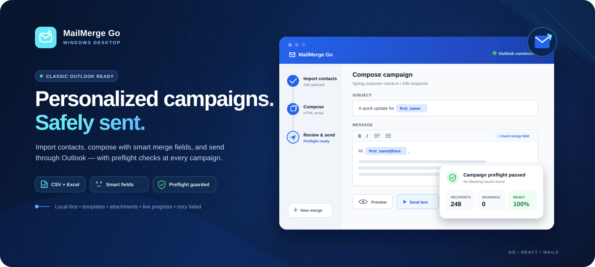

<p align="center">
  
</p>

# MailMerge Go

MailMerge Go is a Windows desktop application for creating and running personalized email campaigns through classic Microsoft Outlook. It combines a Go backend, a React/TypeScript frontend, and Wails v2 in a local desktop application.

> **Outlook support:** sending and draft creation require classic desktop Outlook with a configured mail account. New Outlook does not expose COM automation and is not supported.

## Key capabilities

### Contact import and selection

- Import contacts from CSV and Excel (`.xlsx`) files.
- Use any imported column as a merge field.
- Search, select, and exclude recipients by stable contact ID.
- Detect duplicate email addresses and apply the configured duplicate policy during preflight.
- Reopen recently used contact files.

### Composition and preview

- Compose plain-text or HTML messages.
- Use canonical merge fields such as `{{first_name}}`, `{{company}}`, and `{{account_manager}}`.
- Add fallback values, for example `{{first_name|there}}`.
- Continue using legacy single-brace fields such as `{FirstName}` for backward compatibility.
- Add static or personalized CC and BCC values.
- Preview the rendered subject and body for a selected contact through the same backend renderer used for sending.
- Save and reuse templates.

### Attachments

- Add multiple attachments through the file picker or drag and drop.
- Review individual and combined attachment sizes.
- Deduplicate equivalent Windows paths case-insensitively.
- Resolve and cache attachment metadata during preflight and rendering.

### Safe campaign execution

- Review a structured preflight summary before sending.
- See blocking errors, warnings, recipient count, attachment size, estimated duration, and delivery mode.
- Send a representative test message using one contact’s merge data and an independently selected test destination.
- Save test messages or full campaigns to Outlook Drafts instead of submitting them.
- Track live campaign progress and cancel an active run.
- Distinguish completed, partially failed, stopped, cancelled, preflight-failed, and runtime-failed outcomes.
- Export campaign results to CSV.

### Durable campaign history and retry

- Persist an immutable snapshot of each campaign run locally.
- Review prior runs from the Campaign History screen.
- Retry only recipients whose latest attempt failed.
- Re-run failed recipients after restarting the application.
- Preserve attempt history, parent/child retry lineage, and incrementing run numbers.
- Delete individual history records or clear all campaign history.

## Requirements

### End users

- Windows 10 or Windows 11.
- Classic Microsoft Outlook installed and configured with at least one mail account.

### Developers

- Go 1.24 or later. CI uses Go 1.24.x.
- Node.js 22.23.1, matching CI and release workflows.
- Wails CLI v2.11.0.
- golangci-lint v2.11.4 for local lint parity.

## Installation

### Prebuilt release

Download the latest published build from the [Releases](../../releases) page. Review the release notes and SHA-256 checksums before running the executable.

### Build from source

```powershell
# Install the pinned Wails CLI
go install github.com/wailsapp/wails/v2/cmd/wails@v2.11.0

# Clone the repository, enter it, and build
cd MailMerge-Go
.\scripts\build-windows.ps1
```

The executable is written to `build/bin/MailMergeApp.exe`.

Supported Windows build options:

```powershell
.\scripts\build-windows.ps1                       # Production build
.\scripts\build-windows.ps1 -Clean                # Clean build output first
.\scripts\build-windows.ps1 -Debug                # Include debug symbols
.\scripts\build-windows.ps1 -SkipFrontendInstall  # Reuse installed dependencies
```

Linux and macOS build scripts create the desktop shell on their native platforms, but Outlook sending remains Windows-only.

## Development

Run the application with frontend hot reload:

```powershell
wails dev
```

The Vite development server is available at `http://localhost:34115` for browser-based debugging with access to bound Go methods.

## Using MailMerge Go

### 1. Import contacts

Choose **Select Contact List** and open a CSV or Excel file. An `Email` column is required. `FirstName` and `LastName` are optional but recommended. Additional columns become merge fields.

Column matching is case-insensitive. A sample file is available at `samples/contacts.csv`.

### 2. Compose the message

Enter the subject and body, choose plain-text or HTML mode, and insert merge fields generated from the imported columns.

Canonical merge syntax is documented in [`dev_docs/merge-fields.md`](dev_docs/merge-fields.md). Unknown fields block sending instead of silently rendering as empty. Values inserted into HTML messages are escaped, and authored HTML is sanitized.

### 3. Preview and attach files

Preview the message for a specific contact. Add any attachments and review the total size before continuing.

### 4. Run a test

Open **Send Test Email**, choose the contact that supplies merge data, enter the destination address, and select either immediate sending or Outlook Drafts. The test dialog displays the rendered subject and body before execution.

### 5. Review preflight and run the campaign

Choose the selected recipients and delivery mode, then review the structured preflight dialog. Sending remains blocked while preflight contains a blocking issue.

### 6. Review history and retry failures

Open **Campaign History** to inspect prior runs. Failed recipients can be retried from the persisted campaign snapshot, including after the application has been restarted.

## Keyboard shortcuts

- `Ctrl+O` — open a contact file.
- `Ctrl+S` — save the current message as a template.
- `Ctrl+Enter` — open the test-send workflow.
- `Ctrl+Shift+Enter` — start the selected-recipient workflow.
- `Ctrl+,` — open settings.
- `Ctrl+D` — toggle light and dark mode.
- `Escape` — close the active modal.

## Local data and privacy

Application data is stored locally under `%AppData%\MailMergeGo`:

- `settings.json` — application settings.
- `templates/*.json` — saved templates.
- `suppression.json` — local do-not-send entries.
- `campaigns/*.json` — immutable campaign snapshots and results.

Campaign history can contain recipient data, templates, attachment paths, and result details needed for restart-safe retry. History is retained until the user deletes individual records or clears it; automatic retention is not currently implemented.

MailMerge Go does not send contact data, credentials, or message content to an external service. Messages are submitted through the user’s local Outlook profile. The application does not add tracking pixels or unsubscribe links.

See [`dev_docs/security.md`](dev_docs/security.md) for the security model and [`dev_docs/release-checklist.md`](dev_docs/release-checklist.md) for release validation requirements.

## Testing

Backend and root application checks:

```powershell
gofmt -w .
go vet ./backend/...
go test -race -covermode=atomic -coverprofile=backend-coverage.out ./backend/...
golangci-lint run ./backend/...

# Run on Windows to compile and test Wails-bound application APIs
go test .
```

Frontend checks:

```powershell
cd frontend
npm ci
npm run test -- --coverage
npm run build
npm audit --omit=dev --audit-level=high
```

Reachable Go vulnerability scan:

```powershell
go install golang.org/x/vuln/cmd/govulncheck@latest
govulncheck ./backend/...
```

Outlook COM is isolated behind `campaign.EmailSender`, allowing campaign tests to use `campaign.FakeSender` without Outlook. Opt-in Outlook integration tests use the `outlookintegration` build tag:

```powershell
go test -tags outlookintegration ./backend/outlook/...
```

See [`dev_docs/testing.md`](dev_docs/testing.md) for more detail.

## CI and releases

Every pull request runs five permanent CI jobs:

1. Go formatting, vet, race tests with coverage, and golangci-lint.
2. Frontend installation, tests with coverage, and production build.
3. Reachable Go vulnerability scanning and production npm audit.
4. Go and frontend CycloneDX SBOM generation.
5. Windows Wails build, root-package tests, and unsigned executable artifact upload.

Maintainers should run the manual **Release Candidate** workflow against the intended commit before creating a version tag. Tagged releases generate the executable, release manifest, CycloneDX SBOMs, and SHA-256 checksums, with optional Authenticode signing when repository secrets are configured.

Release evidence is described in [`dev_docs/release-evidence.md`](dev_docs/release-evidence.md).

## Project structure

```text
MailMerge-Go/
├── app.go                         # Wails-bound application controller
├── app_test.go                    # Root application persistence/retry tests
├── main.go                        # Application entry point and build metadata
├── backend/
│   ├── campaign/                  # Renderer, preflight, runner, results, sender interface
│   ├── email/                     # Address validation and duplicate policy
│   ├── graph/                     # Future Microsoft Graph sender design stub
│   ├── htmlutil/                  # HTML normalization and sanitization
│   ├── mergefield/                # Canonical merge-field schema and rendering
│   ├── models/                    # Shared application models
│   ├── outlook/                   # Classic Outlook COM sender and non-Windows stub
│   ├── services/                  # Import, templates, settings, and suppression
│   └── storage/                   # Campaign-history repository and JSON store
├── frontend/src/
│   ├── components/                # Workflow dialogs and reusable UI
│   ├── styles/                    # Application styling
│   └── App.tsx                    # Main workflow composition
├── .github/workflows/             # CI, release-candidate, and tagged-release workflows
├── dev_docs/                      # Architecture, testing, security, and release documentation
├── scripts/                       # Native-platform build entry points
└── samples/contacts.csv           # Sample contact list
```

## Troubleshooting

### Outlook is unavailable

- Confirm classic desktop Outlook is installed, not New Outlook or Outlook on the web.
- Configure at least one mail account and verify Outlook can send manually.
- Open Outlook and resolve any security, sign-in, or modal dialogs.
- Restart Outlook and MailMerge Go if COM automation remains unavailable.

### A campaign fails or stops

- Review the structured campaign result and recipient attempt details.
- Confirm attachment paths still exist and are readable.
- Check Outlook security prompts and organizational policies.
- Retry failed recipients from Campaign History after correcting the underlying issue.

### A contact file does not parse

- Confirm the first nonblank row contains headers.
- Include an `Email` column.
- Check for duplicate headers or unsupported file size and row/column limits.
- Close the file in other applications and try again.

## Known limitations

- Sending and draft creation require classic Outlook COM automation on Windows.
- Sender-account selection and shared-mailbox selection are not currently supported or advertised.
- Microsoft Graph delivery is deferred to a future release.
- Campaign-history retention is user-managed; automatic retention policies are not yet implemented.

## License

MIT License.

## Built with

- [Wails](https://wails.io/)
- [go-ole](https://github.com/go-ole/go-ole)
- [excelize](https://github.com/xuri/excelize)
- [React](https://react.dev/)
- [Lucide](https://lucide.dev/)
- [React Quill](https://github.com/zenoamaro/react-quill)
